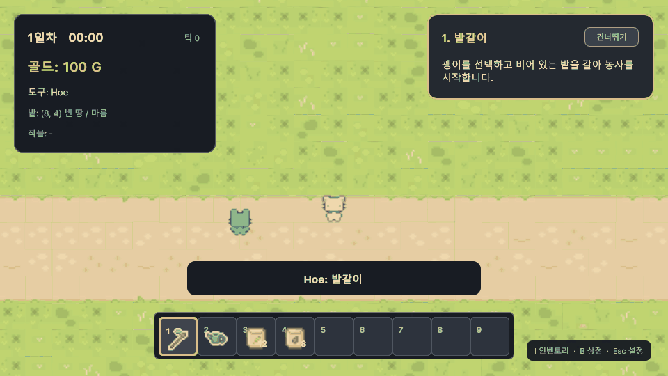

# Tycoon

Unity 6와 C#으로 제작한 싱글 플레이 농장 경영 Vertical Slice입니다. 밭 상태, 작물 성장, 인벤토리, 상점 경제, 씬 전환과 저장/복원을 하나의 3~5분 플레이 루프로 연결했습니다.



**Gameplay GIF:** 실제 FarmScene의 경작 → 성장 → 수확 → 판매 → 재투자 → Save/Load

**Gameplay Video:** [YouTube에서 보기](https://youtu.be/VSVncw0xsNU) · **Silent Systems Preview:** [64초 H.264 MP4](PortfolioMedia/Tycoon_CoreSystems_Preview_Silent.mp4)

무음 프리뷰는 실제 FarmScene PlayMode 캡처를 64초 시스템 설명 흐름으로 편집한 보조 자료이며, 위 Gameplay Video에서 최종 플레이 흐름을 확인할 수 있습니다.

| 개발 | Engine | Language | 핵심 기술 | 최신 검증 |
|---|---|---|---|---|
| 개인 프로젝트 / 1인 개발 | Unity `6000.3.10f1` | C# | Domain State · ScriptableObject · Save/Load · UI Toolkit | EditMode 4/4 · PlayMode 74/74 · Windows Build |

## Overview

플레이어는 도구와 씨앗을 받아 농장으로 이동하고, `경작 → 파종 → 물주기 → 성장 → 수확 → 판매 → 재투자`를 수행합니다. 기능 수보다 상태 일관성과 책임 분리에 집중했으며, 첫 플레이 가이드는 게임 규칙을 직접 변경하지 않고 Farm, Inventory, Economy 상태를 관찰해 진행합니다.

## Core Gameplay Loop

```text
Title → New Game → Main → Farm
                         │
        Till → Plant → Water → Grow → Harvest
                         │                   │
                         └── Buy Seed ← Sell
                                      │
                                  Save / Load
```

- 새 게임: 100G, 괭이, 물뿌리개, 밀 씨앗 12개, 토마토 씨앗 8개
- 조작 피드백: 현재 날짜/시간, 골드, 선택 도구, 대상 타일/작물 상태, 행동 메시지
- 첫 플레이 가이드: Till, Plant, Water, Grow, Harvest, Sell, Buy Seed의 7단계 상태 기반 안내
- 확장 지역: Main 허브에서 Farm, Pasture, Livestock로 이동하며 공통 UI와 지역별 상점 재고를 사용

## Technical Highlights

1. **Farm Domain과 표현 분리** — `FieldTile`과 `CropInstance`가 규칙과 상태를 소유하고, `FarmTileControl`이 Tilemap과 성장 Sprite를 표현합니다.
2. **상태 흐름 연결** — `PlayerController`와 `FarmInteractionController`가 Inventory의 씨앗을 소모하고 수확물을 추가하며, `ShopSystem`과 `EconomyManager`가 판매·재투자를 처리합니다.
3. **복합 Save / Load** — `SaveManager`가 씬, 위치, 선택 슬롯, 시간, 골드, 인벤토리, 밭, 동물과 구조물 상태를 DTO로 저장하고 ID lookup으로 데이터 참조를 복원합니다.
4. **실제 씬 계약 자동 검증** — Editor installer가 런타임 오브젝트를 설치·검증하고, Scene Smoke가 Build Settings의 5개 씬을 실제로 로드합니다.

## Architecture

```text
Input / Player
      │
      ├── FarmInteraction ── Farm Domain ── Tilemap View
      │                              │
      └── Inventory / Hotbar ────────┤
                                     ├── GameSession
Local Merchant ── ShopSystem ── Economy
                                     │
GameManager ── TickManager ── SaveManager ── JSON DTO
      │
SceneFlow / Runtime Installer / UI Toolkit
```

- `GameSession`: 씬 전환 뒤에도 Inventory, Economy, 선택 슬롯과 지역 캐시 유지
- `GameManager`: 상태 전환, Save, Load, New Game 조율
- `FarmGrid` / `FieldTile` / `CropInstance`: 그리드, 타일 규칙, 작물 성장 상태
- `GameDatabase`: Item/Crop ID lookup과 저장 복원용 데이터 등록
- UI Controller: 표시와 입력 위임만 담당하고 핵심 규칙은 Domain/System 계층에 유지

## Data-driven Design

아이템, 작물, 가격과 씨앗-작물 연결은 `Assets/Data`의 ScriptableObject와 `GameDatabase`에서 관리합니다. 작물 추가 시 Farm 규칙 코드를 복제하지 않습니다.

| 작물 | 총 성장 Tick | 씨앗 구매 | 수확물 판매 | 단위 이익 | 역할 |
|---|---:|---:|---:|---:|---|
| Wheat | 40 | 4G | 6G | 2G | 빠른 회전 |
| Tomato | 48 | 6G | 10G | 4G | 균형형 |
| Sunflower | 72 | 10G | 18G | 8G | 느린 고수익 |

실제 FarmScene 데이터의 성장 시간과 가격 순서, 양의 재투자 이익은 PlayMode 테스트가 검증합니다.

## Save / Load

저장 포맷 v2는 다음 상태를 `Application.persistentDataPath/save_data.json`에 기록합니다.

- 현재 Scene과 Player 위치
- 선택 Hotbar 슬롯
- Tick과 Day
- Gold와 36-slot Inventory
- 각 밭의 좌표, 타일 상태, 수분, Crop ID, 성장 단계와 단계 내 진행 Tick
- 동물과 구조물 확장 상태

Load는 ScriptableObject 자체를 직렬화하지 않고 Item/Crop ID로 `GameDatabase`에서 다시 연결합니다. 이전 저장 데이터에 새 필드가 없으면 선택 슬롯과 성장 진행은 안전한 기본값 0으로 복원됩니다.

## Automated Testing

2026-09-01 Unity Test Runner 결과:

- **EditMode 4/4** — Runtime installer의 설치, 재설치 멱등성, 참조/데이터 계약
- **PlayMode 74/74** — Farm 규칙, Inventory/Shop/Economy, Save/Load/New Game, UI, 씬 이동, 5개 실제 씬 smoke와 FarmScene 코어 루프
- **Responsive UI** — 1920×1080, 1600×900, 1280×720 UI Toolkit 렌더 타깃에서 HUD/상점/설정 경계와 모달 겹침 검증
- **C# compile** — `Game.Runtime`, `Assembly-CSharp-Editor`, `PlayMode` 모두 warning 0 / error 0

테스트는 테스트 전용 대체 구현이 아니라 실제 `FarmGrid`, `Inventory`, `ShopSystem`, `SaveManager`와 프로젝트 씬을 사용합니다.
README GIF도 같은 FarmScene 코어 루프 테스트에서 10개 실제 런타임 상태를 960×540으로 캡처해 구성했습니다.

## Editor Tools

- `Tycoon/Runtime Prefab/Install And Validate Configured Scenes` — Build Settings 씬의 런타임 오브젝트 설치와 계약 검증
- `Tycoon/Farm/Setup Farm Scene` — Farm Tilemap, Player, 데이터 참조 구성
- `Tycoon/Build/Build Windows Portfolio` — 활성 Build Settings 씬으로 `Builds/Windows/Tycoon.exe` 생성
- CLI: `Tycoon.Editor.RuntimePrefabSceneInstaller.ReinstallAndValidateConfiguredScenesFromCommandLine`
- CLI: `Tycoon.Editor.PortfolioBuildTool.BuildWindowsPortfolioFromCommandLine`

## Problem Solving

### 성장 중 저장 시 진행도가 되감기던 문제

**원인:** 저장 데이터가 성장 단계만 보관하고 단계 내부의 `GrowthTick`을 누락했습니다.

**해결:** `FieldTileSaveData`에 진행 Tick을 추가하고 `CropInstance.LoadFromSaveData` 경로에 연결했습니다.

**검증:** 성장 1/3 Tick에서 저장한 뒤 상태를 변경해도 Load 후 같은 단계와 1 Tick 진행도로 돌아오는 통합 테스트를 추가했습니다.

### Unity 6 씬 자동 조립의 레거시 Tile 경로

**원인:** 제작 도구가 삭제된 Tile asset 경로를 사용해 새로 조립한 Farm의 바닥/이동 계약이 불안정했습니다.

**해결:** 현재 `DarkDirtsRuleTile.asset`과 기본 walkable 규칙을 사용하도록 installer와 Farm setup을 맞췄습니다.

**검증:** 재설치 후 씬 검증, EditMode installer 계약, 실제 Scene Smoke를 함께 실행했습니다.

### 상점과 HUD가 서로 가리던 문제

**원인:** 공통 HUD와 Hotbar가 전체 화면 상점/설정과 동시에 렌더링됐습니다.

**해결:** `UIController`가 기존 패널들의 공개 상태를 관찰해 모달 동안 HUD/Hotbar의 VisualElement만 숨기고 상태는 유지합니다.

**검증:** 세 해상도 렌더 캡처와 자동 표시 계약으로 상점 제목·닫기 영역의 겹침 제거와 Hotbar 복원을 확인했습니다.

## AI-assisted Development

생성형 AI는 프로젝트 탐색, 반복 코드 초안, 테스트 후보 작성과 문서 구조화에 보조적으로 사용했습니다. 개발자가 요구사항, 도메인 책임, 데이터 값, 합격 기준을 결정하고 변경된 코드·Scene·ScriptableObject wiring을 검토했습니다. AI 결과는 정적 컴파일만으로 승인하지 않고 Unity Test Runner, 실제 씬 로드, 해상도별 렌더 캡처와 Windows Build로 다시 검증했습니다.

## How To Run

1. Unity Hub에서 Unity `6000.3.10f1`로 프로젝트를 엽니다.
2. `Assets/Scenes/TitleScene.unity`를 엽니다.
3. Play를 누르고 `새 게임`을 선택합니다.
4. Main의 오른쪽 길을 따라 Farm으로 이동해 화면의 첫 플레이 가이드를 진행합니다.

| 입력 | 동작 |
|---|---|
| WASD / Arrow | 이동 |
| Left Click / Enter / Space | 선택 도구·씨앗 사용 |
| E | 수확 / 상인 상호작용 |
| 1–9 / Wheel / Q·R | Hotbar 선택 |
| I | Inventory |
| B | Shop |
| Esc | UI 닫기 / Settings |

Windows 실행 파일은 Unity 메뉴 `Tycoon/Build/Build Windows Portfolio`로 생성합니다.

## Scope

- `Assets/Scripts/Network`는 플레이 루프에 연결되지 않은 실험 초안이며 완성 기능으로 주장하지 않습니다.
- Pasture/Livestock의 동물·시설은 보조 확장 콘텐츠입니다. 포트폴리오 핵심 평가는 Farm → Sell → Reinvest → Save/Load 루프입니다.
- 최종 Gameplay Video는 [YouTube](https://youtu.be/VSVncw0xsNU)에 공개했으며, 촬영 구성과 QA 체크리스트는 [PORTFOLIO_GAMEPLAY_CAPTURE.md](PORTFOLIO_GAMEPLAY_CAPTURE.md)에 정리했습니다.

## Documentation

- [Development Status](DEVELOPMENT_STATUS.md)
- [Gameplay Capture Guide](PORTFOLIO_GAMEPLAY_CAPTURE.md)
- [Portfolio Final Report](PORTFOLIO_FINAL_REPORT.md)
